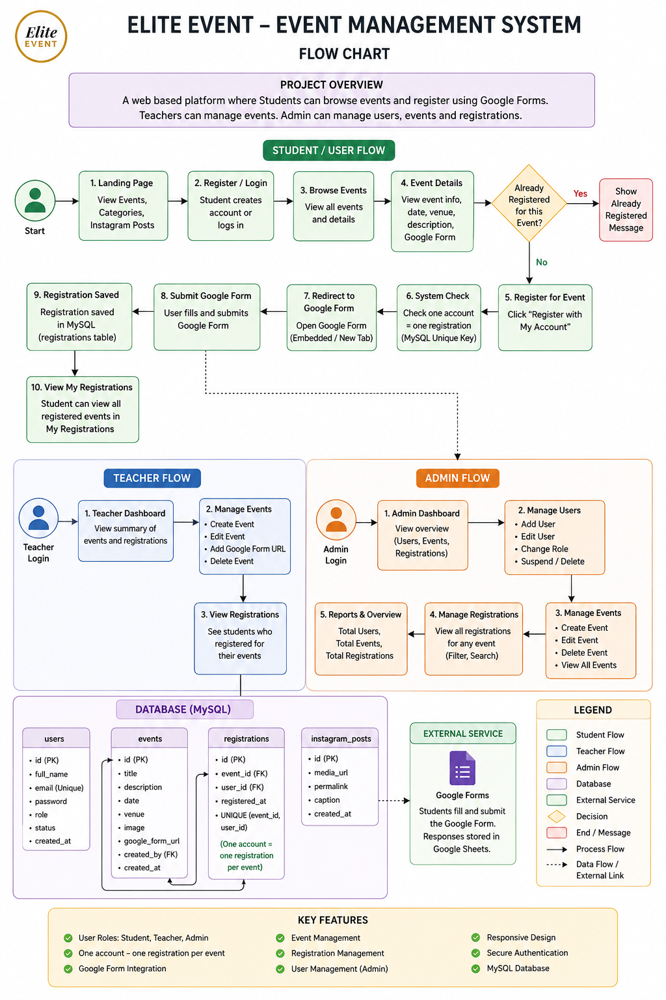
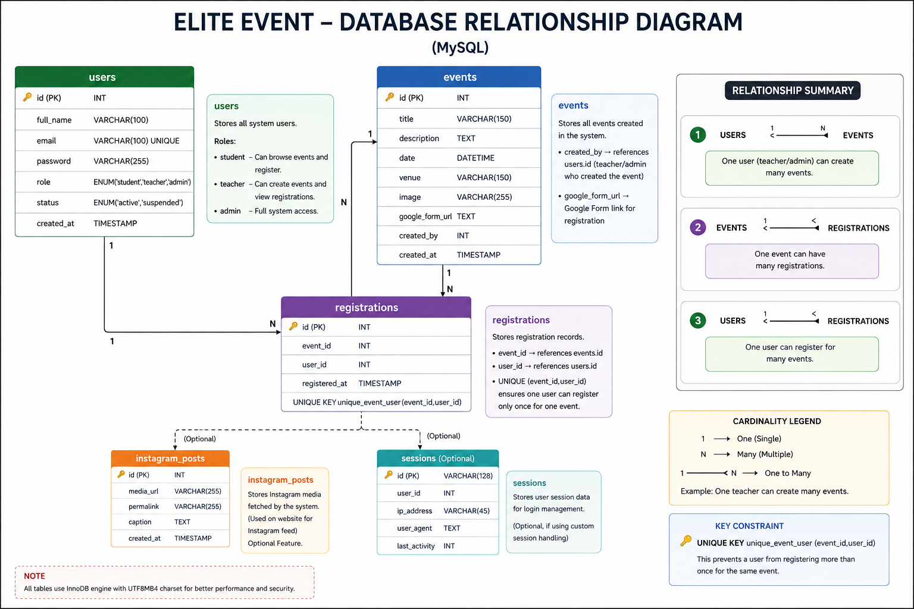

# 🎫 Elite Event – Event Management System

A web-based event management system where students can discover events and register using Google Forms. Teachers and administrators can manage events, users, and registrations.

## 📊 Flow Chart



## ✨ Features

### 👨‍🎓 Student
- Register and log in
- Browse and view events
- Register for events using Google Forms
- View **My Registrations**
- One account can register **only once for the same event**

### 👨‍🏫 Teacher
- Create, edit, and delete events
- Add Google Form URL to events
- View event registrations

### 👨‍💼 Admin
- Manage users and user roles
- Manage events
- Manage registrations
- Search and filter registrations

## 📝 Google Form Integration

Each event can have its own Google Form.

```text
Login
  ↓
Browse Events
  ↓
Event Details
  ↓
Register with My Account
  ↓
Check Registration
  ↓
Google Form
  ↓
Submit Form
  ↓
Registration Saved in MySQL
  ↓
My Registrations
```

Google Forms can collect additional event-specific information, with responses available in Google Sheets.

## 🔐 One Registration Per Event

The system prevents duplicate registration for the same event.

MySQL uses:

```sql
UNIQUE (event_id, user_id)
```

**One User + One Event = One Registration**

## 🗄️ MySQL Database

Main tables:

| Table | Purpose |
|---|---|
| `users` | Student, teacher, and admin accounts |
| `events` | Event information and Google Form URLs |
| `registrations` | Event registration records |
| `instagram_posts` | Instagram post information |

### Database Relationship



## 🛠️ Technologies


## 📁 Project Structure

```text
elite_event/
│
├── admin/
├── teacher/
├── config/
│   └── database.php
├── database/
│   └── elite_event_mysql.sql
├── css/
│   └── style.css
├── includes/
├── index.php
├── login.php
├── signup.php
├── events.php
├── event-detail.php
├── create-event.php
├── registrations.php
└── README.md
```

## 👥 User Roles

| Role | Access |
|---|---|
| Student | Browse events, register, view registrations |
| Teacher | Manage events and view registrations |
| Admin | Manage users, events, and registrations |
